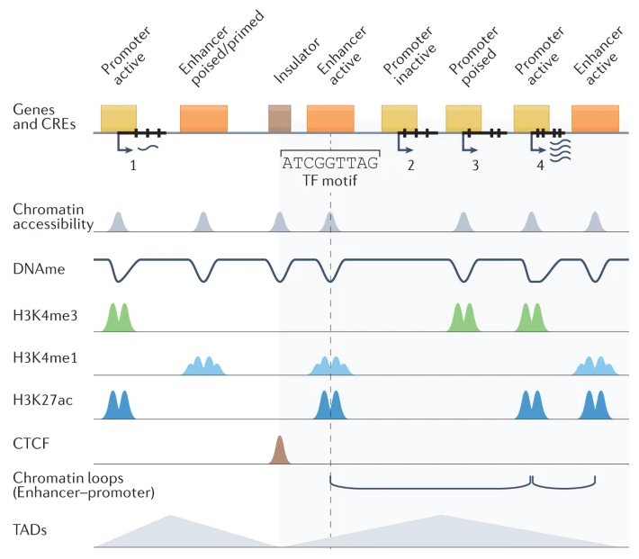

Welcome to my personal blog! The goal of this blog is to have an outlet where I can put ideas and thoughts that are too small to be a published, or too under-cooked to be very widely distributed. The name of the blog was chosen to reflect this goal. Noncoding regions of the human genome are thought to be perhaps underinvestigated when considering their potential importance for cellular processes. For example, they house many pivotal regions such as cis-regulatory elements which are thought to strongly guide gene regulatory programs. However, in variant classification and prioritization, noncoding variants are often largely overlooked. As such, maybe the articles in this blog will function similarly - I do not know how useful the information may be, but perhaps it will be of outsized importance for some people, at some point! 

The main focus of this blog will be topics relating to bioinformatics, my main area of expertise. Most articles will revolve around technologies and methods relevant to genomics, cancer biology, immunology, and cancer immunology, with maybe a smattering of population genetics and personalized genomics in healthcare settings. Occasionally I might write about other things like video games, books, movies, or other hobbies. Thanks for visiting!

::: {#fig-banner}
{width=75% fig-align="center"} 

An overview of CREs, their association with gene expression, and epigenetic features which correlate with their presence - adapted from [Preissl, Gaulton, & Ren, *Nat Rev Genet* (2023)](https://www.nature.com/articles/s41576-022-00509-1#Abs1)
:::
